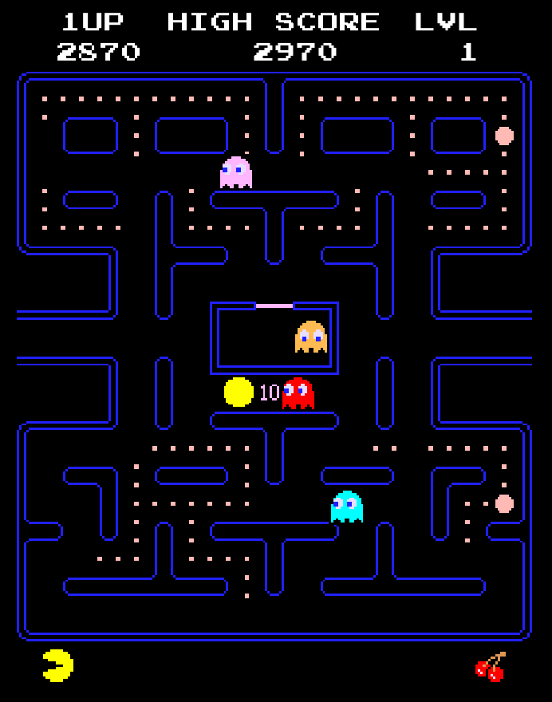

# Wakaman - A Pac-Man Implementation

Wakaman is a Pac-Man implementation done in Unity using [Tileset Tools](https://docs.unity3d.com/Manual//Tilemap-CreatingTiles.html), [A* Pathfinding](https://www.redblobgames.com/pathfinding/a-star/introduction.html) and some [Game Programming Patterns](https://gameprogrammingpatterns.com/).

## Description

This is a modern implementation of 80's arcade classic Pac-Man done in Unity. It contains some interesting code architecture decisions, such as the usage of the Unity built-in state machine for implementing the AI and an event system for Audio, UI and Game State control.

The AI is based on the original game AI (described [here](https://gameinternals.com/post/2072558330/understanding-pac-man-ghost-behavior)) with ghost pathing enhancements.

## Key features
- Animator-based State Machine for the AI;
- Observer pattern for Audio and Game Events;
- A* Pathfinding for the Ghosts - better than the original algorithm!

## Screenshots

## Contact

Wakaman is a project made by Leonardo Tagliaro.
* [leonardotgo@gmail.com](mailto:leonardotgo@gmail.com)
* [Facebook](https://www.facebook.com/leonardo.tagliaro)
* [Twitter](https://twitter.com/leotgo)
* [itch.io](https://leotgo.itch.io/)
